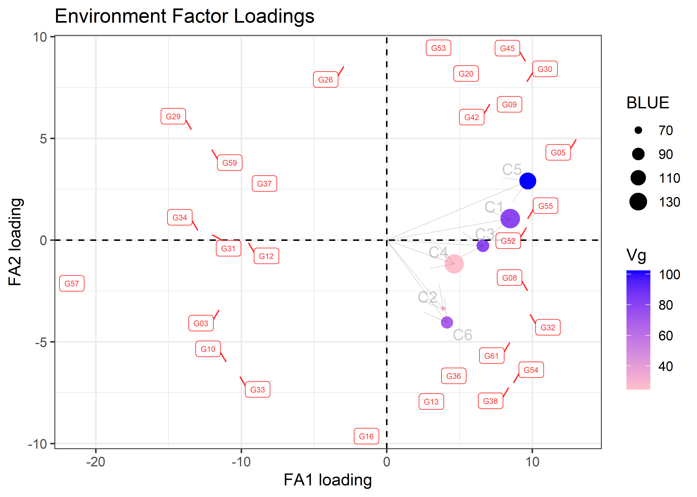

<!-- README.md is generated from README.Rmd. Please edit that file -->

# agriutilities </a>

<!-- badges: start -->

[](https://CRAN.R-project.org/package=agriutilities)
[](https://lifecycle.r-lib.org/articles/stages.html#stable)
[](https://r-pkg.org/pkg/agriutilities)
[](https://r-pkg.org/pkg/agriutilities)
<!-- badges: end -->

agriutilities is an `R` package designed to make the analysis of field
trials easier and more accessible for everyone working in plant
breeding. It provides a simple and intuitive interface for conducting
**single** and **multi-environmental** trial analysis, with minimal
coding required. Whether you’re a beginner or an experienced user,
agriutilities will help you quickly and easily carry out complex
analyses with confidence. With built-in functions for fitting Linear
Mixed Models (**LMM**), agriutilities is the ideal choice for anyone who
wants to save time and focus on interpreting their results.

## Installation

### From CRAN

``` r
install.packages("agriutilities")
```

### From GitHub

You can install the development version of agriutilities from
[GitHub](https://github.com/AparicioJohan/agriutilities) with:

``` r
remotes::install_github("AparicioJohan/agriutilities")
```

## Automatic Data Analysis Pipeline

This is a basic example which shows you how to use some of the functions
of the package.

### Identify the Experimental Design

The function `check_design_met` helps us to check the quality of the
data and also to identify the experimental design of the trials. This
works as a quality check or quality control before we fit any model.

``` r
library(agriutilities)
library(agridat)
data(besag.met)
dat <- besag.met
results <- check_design_met(
  data = dat,
  genotype = "gen",
  trial = "county",
  traits = "yield",
  rep = "rep",
  block = "block",
  col = "col",
  row = "row"
)
```

``` r
plot(results, type = "connectivity")
```


``` r
plot(results, type = "missing")
```


Inspecting the output.

``` r
print(results)
---------------------------------------------------------------------
Summary Traits by Trial:
---------------------------------------------------------------------
# A tibble: 6 × 11
  county traits   Min  Mean Median   Max    SD    CV     n n_miss miss_perc
  <fct>  <chr>  <dbl> <dbl>  <dbl> <dbl> <dbl> <dbl> <int>  <int>     <dbl>
1 C1     yield   87.9 149.   151.   200.  17.7 0.119   198      6    0.0303
2 C2     yield   24.4  56.1   52.1  125.  18.4 0.328   198      6    0.0303
3 C3     yield   28.2  87.9   89.2  137.  19.7 0.225   198      6    0.0303
4 C4     yield  103.  145.   143.   190.  17.1 0.118   198      6    0.0303
5 C5     yield   66.9 115.   116.   152.  16.4 0.142   198      6    0.0303
6 C6     yield   29.2  87.6   87.8  148.  26.6 0.304   198      6    0.0303

---------------------------------------------------------------------
Experimental Design Detected:
---------------------------------------------------------------------
  county exp_design
1     C1    row_col
2     C2    row_col
3     C3    row_col
4     C4    row_col
5     C5    row_col
6     C6    row_col

---------------------------------------------------------------------
Summary Experimental Design:
---------------------------------------------------------------------
# A tibble: 6 × 9
  county     n n_gen n_rep n_block n_col n_row num_of_reps num_of_gen
  <fct>  <int> <int> <int>   <int> <int> <int> <fct>       <fct>     
1 C1       198    64     3       8    11    18 3_9         63_1      
2 C2       198    64     3       8    11    18 3_9         63_1      
3 C3       198    64     3       8    11    18 3_9         63_1      
4 C4       198    64     3       8    11    18 3_9         63_1      
5 C5       198    64     3       8    11    18 3_9         63_1      
6 C6       198    64     3       8    11    18 3_9         63_1      

---------------------------------------------------------------------
Connectivity Matrix:
---------------------------------------------------------------------
   C1 C2 C3 C4 C5 C6
C1 64 64 64 64 64 64
C2 64 64 64 64 64 64
C3 64 64 64 64 64 64
C4 64 64 64 64 64 64
C5 64 64 64 64 64 64
C6 64 64 64 64 64 64

---------------------------------------------------------------------
Filters Applied:
---------------------------------------------------------------------
List of 1
 $ yield:List of 4
  ..$ missing_50%     : chr(0) 
  ..$ no_variation    : chr(0) 
  ..$ row_col_dup     : chr(0) 
  ..$ trials_to_remove: chr(0) 
```

### Single Trial Analysis (STA)

The results of the previous function are used in
`single_trial_analysis()` to fit single trial models. This function can
fit, Completely Randomized Designs (**CRD**), Randomized Complete Block
Designs (**RCBD**), Resolvable Incomplete Block Designs (**res-IBD**),
Non-Resolvable Row-Column Designs (**Row-Col**) and Resolvable
Row-Column Designs (**res-Row-Col**).

> **NOTE**: It fits models based on the randomization detected.

``` r
obj <- single_trial_analysis(results, progress = FALSE)
```

Inspecting the output.

``` r
print(obj)
---------------------------------------------------------------------
Summary Fitted Models:
---------------------------------------------------------------------
    trait  trial heritability        CV    VarGen    VarErr  design
   <char> <char>        <num>     <num>     <num>     <num>  <char>
1:  yield     C1         0.70  6.370054  85.28086  92.70982 row_col
2:  yield     C2         0.39 16.987235  26.87283 105.50494 row_col
3:  yield     C3         0.64 12.366843  82.84379 118.86865 row_col
4:  yield     C4         0.41  8.179794  35.75059 136.21686 row_col
5:  yield     C5         0.80  7.042116 104.44077  66.96454 row_col
6:  yield     C6         0.49 16.583972  72.16813 206.54020 row_col

---------------------------------------------------------------------
Outliers Removed:
---------------------------------------------------------------------
Null data.table (0 rows and 0 cols)

---------------------------------------------------------------------
First Predicted Values and Standard Errors (BLUEs/BLUPs):
---------------------------------------------------------------------
    trait genotype  trial    BLUEs  seBLUEs    BLUPs  seBLUPs         wt
   <char>   <fctr> <fctr>    <num>    <num>    <num>    <num>      <num>
1:  yield      G01     C1 142.9316 6.380244 144.5151 5.421481 0.02456549
2:  yield      G02     C1 156.7765 6.277083 155.0523 5.367425 0.02537957
3:  yield      G03     C1 126.5654 6.402526 133.1766 5.444349 0.02439480
4:  yield      G04     C1 155.7790 6.391590 154.2435 5.440070 0.02447836
5:  yield      G05     C1 163.9856 6.443261 160.7620 5.444314 0.02408732
6:  yield      G06     C1 129.5092 6.400364 134.7404 5.421543 0.02441129
```

``` r
plot(obj, horizontal = TRUE, nudge_y_h2 = 0.12)
```


``` r
plot(obj, type = "correlation")
```


The returning object is a set of lists with trial summary, BLUEs, BLUPs,
heritability, variance components, potential extreme observations,
residuals, the models fitted and the data used.

### Two-Stage Analysis (MET)

The results of the previous function are used in `met_analysis()` to fit
multi-environmental trial models.

``` r
met_results <- met_analysis(obj, vcov = "fa2", progress = FALSE)
Online License checked out Thu Oct 16 21:37:04 2025
```

Inspecting the output.

``` r
print(met_results)
---------------------------------------------------------------------
Trial Effects (BLUEs):
---------------------------------------------------------------------
  trait trial predicted.value std.error    status
1 yield    C1       149.59014  1.369766 Estimable
2 yield    C2        67.20545  1.137972 Estimable
3 yield    C3        90.79958  1.441812 Estimable
4 yield    C4       148.12623  1.172130 Estimable
5 yield    C5       122.40195  1.440843 Estimable
6 yield    C6        88.35437  1.530165 Estimable

---------------------------------------------------------------------
Heritability:
---------------------------------------------------------------------
  trait        h2
1 yield 0.8261367

---------------------------------------------------------------------
First Overall Predicted Values and Standard Errors (BLUPs):
---------------------------------------------------------------------
  trait genotype predicted.value std.error    status
1 yield      G01        110.8429  2.536428 Estimable
2 yield      G02        111.3836  2.548777 Estimable
3 yield      G03        102.6612  2.551662 Estimable
4 yield      G04        115.8775  2.546016 Estimable
5 yield      G05        121.0640  2.558195 Estimable
6 yield      G06        108.9498  2.570048 Estimable

---------------------------------------------------------------------
Variance-Covariance Matrix:
---------------------------------------------------------------------

Correlation Matrix ('fa2'): yield
     C1   C2   C3   C4   C5   C6
C1 1.00 0.64 0.71 0.86 0.95 0.42
C2 0.64 1.00 0.58 0.86 0.53 0.70
C3 0.71 0.58 1.00 0.70 0.71 0.39
C4 0.86 0.86 0.70 1.00 0.83 0.58
C5 0.95 0.53 0.71 0.83 1.00 0.34
C6 0.42 0.70 0.39 0.58 0.34 1.00

Covariance Matrix ('fa2'): yield
      C1    C2    C3    C4     C5    C6
C1 78.93 29.35 55.78 38.05  85.20 30.76
C2 29.35 26.42 26.61 21.93  27.81 29.68
C3 55.78 26.61 78.65 30.97  63.27 28.46
C4 38.05 21.93 30.97 24.55  41.49 23.89
C5 85.20 27.81 63.27 41.49 102.30 28.28
C6 30.76 29.68 28.46 23.89  28.28 67.99

---------------------------------------------------------------------
First Stability Coefficients:
---------------------------------------------------------------------
  trait genotype superiority   static    wricke predicted.value
1 yield      G57    22.64170 32.92556 15.484987        92.63362
2 yield      G29    17.03322 33.66855  5.023783        99.67843
3 yield      G34    17.02203 33.06040  8.545979       100.06674
4 yield      G59    16.72402 34.06416  5.596864       100.14511
5 yield      G31    15.77027 31.36932 10.740548       102.04249
6 yield      G10    15.59219 32.03990 11.767180       102.64704
```

### Exploring Factor Analytic in MET analysis.

``` r
pvals <- met_results$trial_effects
model <- met_results$met_models$yield
fa_objt <- fa_summary(
  model = model,
  trial = "trial",
  genotype = "genotype",
  BLUEs_trial = pvals,
  k_biplot = 8,
  size_label_var = 4,
  filter_score = 1
)
```

``` r
fa_objt$plots$loadings_c
```


``` r
fa_objt$plots$biplot
```



For more information and to learn more about what is described here you
may find useful the following sources: Isik, Holland, and Maltecca
(2017); Rodriguez-Alvarez et al. (2018).

## Code of Conduct

Please note that the agriutilities project is released with a
[Contributor Code of
Conduct](https://apariciojohan.github.io/agriutilities/CODE_OF_CONDUCT.html).
By contributing to this project, you agree to abide by its terms.

# References

<div id="refs" class="references csl-bib-body hanging-indent"
entry-spacing="0">

<div id="ref-isik2017genetic" class="csl-entry">

Isik, Fikret, James Holland, and Christian Maltecca. 2017. *Genetic Data
Analysis for Plant and Animal Breeding*. Vol. 400. Springer.

</div>

<div id="ref-rodriguez2018correcting" class="csl-entry">

Rodriguez-Alvarez, Maria Xose, Martin P Boer, Fred A van Eeuwijk, and
Paul HC Eilers. 2018. “Correcting for Spatial Heterogeneity in Plant
Breeding Experiments with p-Splines.” *Spatial Statistics* 23: 52–71.

</div>

</div>
