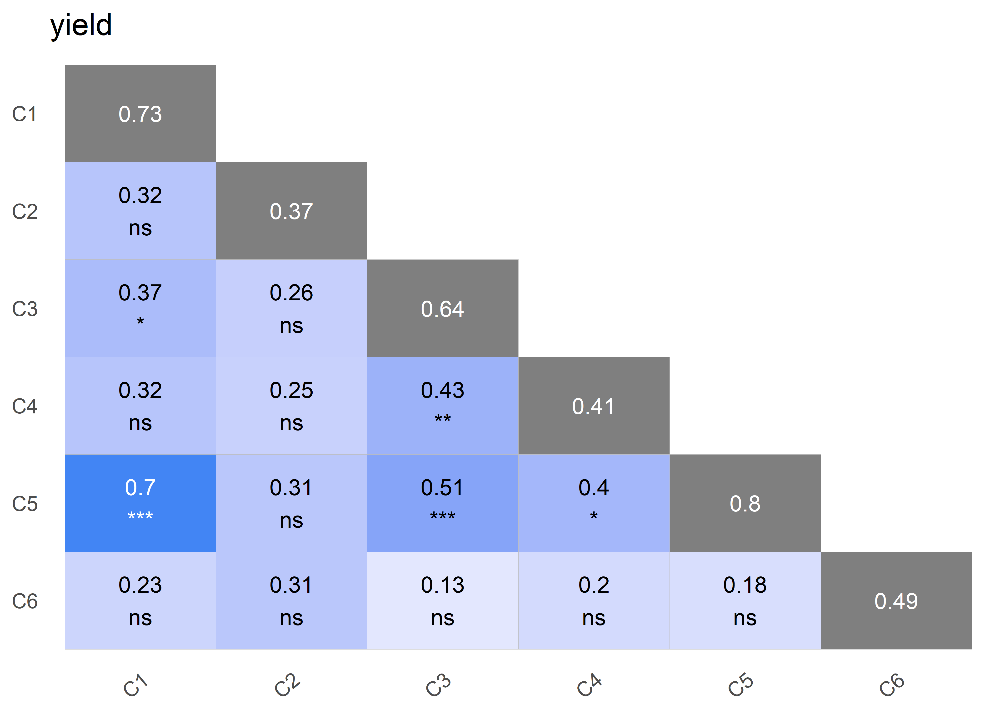

<!-- README.md is generated from README.Rmd. Please edit that file -->

# agriutilities </a>

<!-- badges: start -->

[](https://CRAN.R-project.org/package=agriutilities)
[](https://lifecycle.r-lib.org/articles/stages.html#stable)
[](https://r-pkg.org/pkg/agriutilities)
[](https://r-pkg.org/pkg/agriutilities)
<!-- badges: end -->

agriutilities is an `R` package designed to make the analysis of field
trials easier and more accessible for everyone working in plant
breeding. It provides a simple and intuitive interface for conducting
**single** and **multi-environmental** trial analysis, with minimal
coding required. Whether you’re a beginner or an experienced user,
agriutilities will help you quickly and easily carry out complex
analyses with confidence. With built-in functions for fitting Linear
Mixed Models (**LMM**), agriutilities is the ideal choice for anyone who
wants to save time and focus on interpreting their results.

## Installation

### From CRAN

``` r
install.packages("agriutilities")
```

### From GitHub

You can install the development version of agriutilities from
[GitHub](https://github.com/AparicioJohan/agriutilities) with:

``` r
remotes::install_github("AparicioJohan/agriutilities")
```

## Automatic Data Analysis Pipeline

This is a basic example which shows you how to use some of the functions
of the package.

### Identify the Experimental Design

The function `check_design_met` helps us to check the quality of the
data and also to identify the experimental design of the trials. This
works as a quality check or quality control before we fit any model.

``` r
library(agriutilities)
library(agridat)
data(besag.met)
dat <- besag.met
results <- check_design_met(
  data = dat,
  genotype = "gen",
  trial = "county",
  traits = "yield",
  rep = "rep",
  block = "block",
  col = "col",
  row = "row"
)
```

``` r
plot(results, type = "connectivity")
```


``` r
plot(results, type = "missing")
```


Inspecting the output.

``` r
print(results)
---------------------------------------------------------------------
Summary Traits by Trial:
---------------------------------------------------------------------
# A tibble: 6 x 11
  county traits   Min  Mean Median   Max    SD    CV     n n_miss miss_perc
  <fct>  <chr>  <dbl> <dbl>  <dbl> <dbl> <dbl> <dbl> <int>  <int>     <dbl>
1 C1     yield   87.9 149.   151.   200.  17.7 0.119   198      6    0.0303
2 C2     yield   24.4  56.1   52.1  125.  18.4 0.328   198      6    0.0303
3 C3     yield   28.2  87.9   89.2  137.  19.7 0.225   198      6    0.0303
4 C4     yield  103.  145.   143.   190.  17.1 0.118   198      6    0.0303
5 C5     yield   66.9 115.   116.   152.  16.4 0.142   198      6    0.0303
6 C6     yield   29.2  87.6   87.8  148.  26.6 0.304   198      6    0.0303

---------------------------------------------------------------------
Experimental Design Detected:
---------------------------------------------------------------------
  county exp_design
1     C1    row_col
2     C2    row_col
3     C3    row_col
4     C4    row_col
5     C5    row_col
6     C6    row_col

---------------------------------------------------------------------
Summary Experimental Design:
---------------------------------------------------------------------
# A tibble: 6 x 9
  county     n n_gen n_rep n_block n_col n_row num_of_reps num_of_gen
  <fct>  <int> <int> <int>   <int> <int> <int> <fct>       <fct>     
1 C1       198    64     3       8    11    18 3_9         63_1      
2 C2       198    64     3       8    11    18 3_9         63_1      
3 C3       198    64     3       8    11    18 3_9         63_1      
4 C4       198    64     3       8    11    18 3_9         63_1      
5 C5       198    64     3       8    11    18 3_9         63_1      
6 C6       198    64     3       8    11    18 3_9         63_1      

---------------------------------------------------------------------
Connectivity Matrix:
---------------------------------------------------------------------
   C1 C2 C3 C4 C5 C6
C1 64 64 64 64 64 64
C2 64 64 64 64 64 64
C3 64 64 64 64 64 64
C4 64 64 64 64 64 64
C5 64 64 64 64 64 64
C6 64 64 64 64 64 64

---------------------------------------------------------------------
Filters Applied:
---------------------------------------------------------------------
List of 1
 $ yield:List of 4
  ..$ missing_50%     : chr(0) 
  ..$ no_variation    : chr(0) 
  ..$ row_col_dup     : chr(0) 
  ..$ trials_to_remove: chr(0) 
```

### Single Trial Analysis (STA)

The results of the previous function are used in
`single_trial_analysis()` to fit single trial models. This function can
fit, Completely Randomized Designs (**CRD**), Randomized Complete Block
Designs (**RCBD**), Resolvable Incomplete Block Designs (**res-IBD**),
Non-Resolvable Row-Column Designs (**Row-Col**) and Resolvable
Row-Column Designs (**res-Row-Col**).

> **NOTE**: It fits models based on the randomization detected.

``` r
obj <- single_trial_analysis(results, progress = FALSE)
```

Inspecting the output.

``` r
print(obj)
---------------------------------------------------------------------
Summary Fitted Models:
---------------------------------------------------------------------
   trait trial heritability        CV    VarGen    VarErr  design
1: yield    C1         0.73  6.022489  87.39848  82.86095 row_col
2: yield    C2         0.37 17.104998  25.80684 108.68546 row_col
3: yield    C3         0.64 12.357202  83.57907 118.55567 row_col
4: yield    C4         0.41  8.179408  35.75568 136.21218 row_col
5: yield    C5         0.80  7.037586 103.79822  66.97523 row_col
6: yield    C6         0.49 16.632367  71.92232 207.53073 row_col

---------------------------------------------------------------------
Outliers Removed:
---------------------------------------------------------------------
   trait trial genotype id outlier
1: yield    C1      G60 50    TRUE

---------------------------------------------------------------------
First Predicted Values and Standard Errors (BLUEs/BLUPs):
---------------------------------------------------------------------
   trait genotype trial    BLUEs  seBLUEs    BLUPs  seBLUPs         wt
1: yield      G01    C1 141.4161 6.078858 143.5308 5.249771 0.02706176
2: yield      G02    C1 157.8110 5.979708 155.8037 5.194547 0.02796663
3: yield      G03    C1 127.3836 6.091534 133.0256 5.269999 0.02694925
4: yield      G04    C1 154.8445 6.093866 153.8364 5.270427 0.02692863
5: yield      G05    C1 163.8950 6.132141 161.1831 5.271809 0.02659352
6: yield      G06    C1 128.5168 6.087902 133.6857 5.247130 0.02698141
```

``` r
plot(obj, horizontal = TRUE, nudge_y_h2 = 0.12)
```


``` r
plot(obj, type = "correlation")
```



The returning object is a set of lists with trial summary, BLUEs, BLUPs,
heritability, variance components, potential extreme observations,
residuals, the models fitted and the data used.

### Two-Stage Analysis (MET)

The results of the previous function are used in `met_analysis()` to fit
multi-environmental trial models.

``` r
met_results <- met_analysis(obj, vcov = "fa2", progress = FALSE)
Online License checked out Fri Mar 17 10:52:52 2023
Online License checked out Fri Mar 17 10:52:53 2023
```

Inspecting the output.

``` r
print(met_results)
---------------------------------------------------------------------
Trial Effects (BLUEs):
---------------------------------------------------------------------
  trait trial predicted.value std.error    status
1 yield    C1       149.75463  1.357203 Estimable
2 yield    C2        65.99443  1.140633 Estimable
3 yield    C3        90.60647  1.445419 Estimable
4 yield    C4       148.12551  1.172065 Estimable
5 yield    C5       121.77655  1.434386 Estimable
6 yield    C6        88.31651  1.532150 Estimable

---------------------------------------------------------------------
Heritability:
---------------------------------------------------------------------
  trait        h2
1 yield 0.8253127

---------------------------------------------------------------------
First Overall Predicted Values and Standard Errors (BLUPs):
---------------------------------------------------------------------
  trait genotype predicted.value std.error    status
1 yield      G01        110.4107  2.524415 Estimable
2 yield      G02        111.0488  2.534145 Estimable
3 yield      G03        102.6031  2.538533 Estimable
4 yield      G04        115.3953  2.530336 Estimable
5 yield      G05        120.6700  2.545688 Estimable
6 yield      G06        108.6678  2.552319 Estimable

---------------------------------------------------------------------
Variance-Covariance Matrix:
---------------------------------------------------------------------

Correlation Matrix ('fa2'): yield
     C1   C2   C3   C4   C5   C6
C1 1.00 0.54 0.67 0.81 0.93 0.35
C2 0.54 1.00 0.60 0.90 0.52 0.68
C3 0.67 0.60 1.00 0.73 0.70 0.40
C4 0.81 0.90 0.73 1.00 0.83 0.60
C5 0.93 0.52 0.70 0.83 1.00 0.34
C6 0.35 0.68 0.40 0.60 0.34 1.00

Covariance Matrix ('fa2'): yield
      C1    C2    C3    C4     C5    C6
C1 80.39 25.73 53.51 35.80  84.13 25.75
C2 25.73 28.74 28.50 23.86  28.05 29.67
C3 53.51 28.50 78.96 32.26  62.98 28.93
C4 35.80 23.86 32.26 24.54  41.43 24.38
C5 84.13 28.05 62.98 41.43 101.53 27.94
C6 25.75 29.67 28.93 24.38  27.94 66.57

---------------------------------------------------------------------
First Stability Coefficients:
---------------------------------------------------------------------
  trait genotype superiority   static    wricke predicted.value
1 yield      G57    22.56100 33.35260 15.210394        92.44993
2 yield      G29    16.98170 34.39632  4.243540        99.41798
3 yield      G34    16.98545 33.64634  8.152888        99.81112
4 yield      G59    16.68886 34.56884  5.361337        99.91280
5 yield      G31    15.97985 31.29838 12.350068       101.69455
6 yield      G10    15.61917 32.24828 11.747802       102.32827
```

### Exploring Factor Analytic in MET analysis.

``` r
pvals <- met_results$trial_effects
model <- met_results$met_models$yield
fa_objt <- fa_summary(
  model = model,
  trial = "trial",
  genotype = "genotype",
  BLUEs_trial = pvals,
  k_biplot = 8,
  size_label_var = 4,
  filter_score = 1
)
```

``` r
fa_objt$plots$loadings_c
```


``` r
fa_objt$plots$biplot
```


For more information and to learn more about what is described here you
may find useful the following sources: Isik, Holland, and Maltecca
(2017); Rodriguez-Alvarez et al. (2018).

## Code of Conduct

Please note that the agriutilities project is released with a
[Contributor Code of
Conduct](https://apariciojohan.github.io/agriutilities/CODE_OF_CONDUCT.html).
By contributing to this project, you agree to abide by its terms.

# References

<div id="refs" class="references csl-bib-body hanging-indent">

<div id="ref-isik2017genetic" class="csl-entry">

Isik, Fikret, James Holland, and Christian Maltecca. 2017. *Genetic Data
Analysis for Plant and Animal Breeding*. Vol. 400. Springer.

</div>

<div id="ref-rodriguez2018correcting" class="csl-entry">

Rodriguez-Alvarez, Maria Xose, Martin P Boer, Fred A van Eeuwijk, and
Paul HC Eilers. 2018. “Correcting for Spatial Heterogeneity in Plant
Breeding Experiments with p-Splines.” *Spatial Statistics* 23: 52–71.

</div>

</div>
