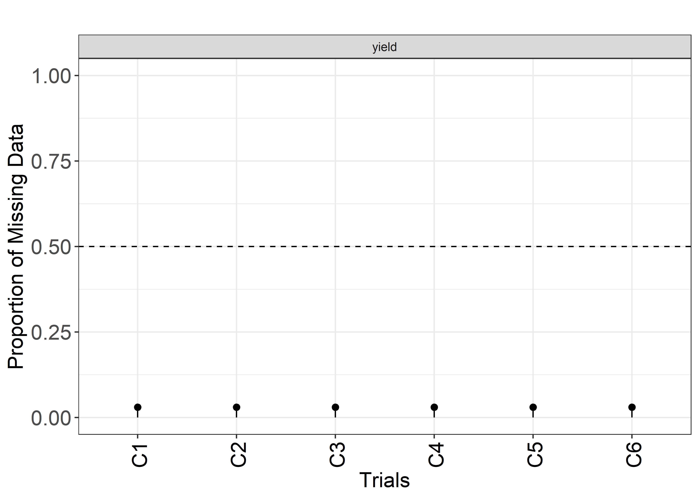

<!-- README.md is generated from README.Rmd. Please edit that file -->

# agriutilities </a>

agriutilities is an `R` package designed to make the analysis of field
trials easier and more accessible for everyone working in plant
breeding. It provides a simple and intuitive interface for conducting
**single** and **multi-environmental** trial analysis, with minimal
coding required. Whether you’re a beginner or an experienced user,
agriutilities will help you quickly and easily carry out complex
analyses with confidence. With built-in functions for fitting Linear
Mixed Models (**LMM**), agriutilities is the ideal choice for anyone who
wants to save time and focus on interpreting their results.

## Installation

### From CRAN

``` r
install.packages("agriutilities")
```

### From GitHub

You can install the development version of agriutilities from
[GitHub](https://github.com/AparicioJohan/agriutilities) with:

``` r
remotes::install_github("AparicioJohan/agriutilities")
```

## Automatic Data Analysis Pipeline

This is a basic example which shows you how to use some of the functions
of the package.

### Identify the Experimental Design

The function `check_design_met` helps us to check the quality of the
data and also to identify the experimental design of the trials. This
works as a quality check or quality control before we fit any model.

``` r
library(agriutilities)
library(agridat)
data(besag.met)
dat <- besag.met
results <- check_design_met(
  data = dat,
  genotype = "gen",
  trial = "county",
  traits = "yield",
  rep = "rep",
  block = "block",
  col = "col",
  row = "row"
)
```

``` r
plot(results, type = "connectivity")
```


``` r
plot(results, type = "missing")
```



### Single Trial Analysis (STA)

The results of the previous function are used in
`single_trial_analysis()` to fit single trial models. This function can
fit, Completely Randomized Designs (**CRD**), Randomized Complete Block
Designs (**RCBD**), Resolvable Incomplete Block Designs (**res-IBD**),
Non-Resolvable Row-Column Designs (**Row-Col**) and Resolvable
Row-Column Designs (**res-Row-Col**).

> **NOTE**: It fits models based on the randomization detected.

``` r
obj <- single_trial_analysis(results, progress = FALSE)
```

``` r
plot(obj, horizontal = TRUE, nudge_y_h2 = 0.12)
```


``` r
plot(obj, type = "correlation")
```


The returning object is a set of lists with trial summary, BLUEs, BLUPs,
heritability, variance components, potential extreme observations,
residuals, the models fitted and the data used.

### Two-Stage Analysis (MET)

The results of the previous function are used in `met_analysis()` to fit
multi-environmental trial models.

``` r
met_results <- met_analysis(obj, progress = FALSE)
Online License checked out Tue Mar  7 09:29:36 2023
Online License checked out Tue Mar  7 09:29:37 2023
```

### Inspect the Outputs

``` r
print(results)
---------------------------------------------------------------------
Summary Traits by Trial:
---------------------------------------------------------------------
# A tibble: 6 x 9
  county traits  Mean Median    SD    CV     n n_miss miss_perc
  <fct>  <chr>  <dbl>  <dbl> <dbl> <dbl> <int>  <int>     <dbl>
1 C1     yield  149.   151.   17.7 0.119   198      6    0.0303
2 C2     yield   56.1   52.1  18.4 0.328   198      6    0.0303
3 C3     yield   87.9   89.2  19.7 0.225   198      6    0.0303
4 C4     yield  145.   143.   17.1 0.118   198      6    0.0303
5 C5     yield  115.   116.   16.4 0.142   198      6    0.0303
6 C6     yield   87.6   87.8  26.6 0.304   198      6    0.0303

---------------------------------------------------------------------
Experimental Design Detected:
---------------------------------------------------------------------
  county exp_design
1     C1    row_col
2     C2    row_col
3     C3    row_col
4     C4    row_col
5     C5    row_col
6     C6    row_col

---------------------------------------------------------------------
Summary Experimental Design:
---------------------------------------------------------------------
# A tibble: 6 x 9
  county     n n_gen n_rep n_block n_col n_row num_of_reps num_of_gen
  <fct>  <int> <int> <int>   <int> <int> <int> <fct>       <fct>     
1 C1       198    64     3       8    11    18 3_9         63_1      
2 C2       198    64     3       8    11    18 3_9         63_1      
3 C3       198    64     3       8    11    18 3_9         63_1      
4 C4       198    64     3       8    11    18 3_9         63_1      
5 C5       198    64     3       8    11    18 3_9         63_1      
6 C6       198    64     3       8    11    18 3_9         63_1      

---------------------------------------------------------------------
Connectivity Matrix:
---------------------------------------------------------------------
   C1 C2 C3 C4 C5 C6
C1 64 64 64 64 64 64
C2 64 64 64 64 64 64
C3 64 64 64 64 64 64
C4 64 64 64 64 64 64
C5 64 64 64 64 64 64
C6 64 64 64 64 64 64

---------------------------------------------------------------------
Filters Applied:
---------------------------------------------------------------------
List of 1
 $ yield:List of 4
  ..$ missing_50%     : chr(0) 
  ..$ no_variation    : chr(0) 
  ..$ row_col_dup     : chr(0) 
  ..$ trials_to_remove: chr(0) 
```

<hr>

``` r
print(obj)
---------------------------------------------------------------------
Summary Fitted Models:
---------------------------------------------------------------------
   trait trial heritability        CV    VarGen    VarErr  design
1: yield    C1         0.73  6.022489  87.39848  82.86095 row_col
2: yield    C2         0.37 17.104998  25.80684 108.68546 row_col
3: yield    C3         0.64 12.357202  83.57907 118.55567 row_col
4: yield    C4         0.41  8.179408  35.75568 136.21218 row_col
5: yield    C5         0.80  7.037586 103.79822  66.97523 row_col
6: yield    C6         0.49 16.632367  71.92232 207.53073 row_col

---------------------------------------------------------------------
Outliers Removed:
---------------------------------------------------------------------
   trait trial genotype id outlier
1: yield    C1      G60 50    TRUE

---------------------------------------------------------------------
First Predicted Values and Standard Errors (BLUEs/BLUPs):
---------------------------------------------------------------------
   trait genotype trial    BLUEs  seBLUEs    BLUPs  seBLUPs         wt
1: yield      G01    C1 141.4161 6.078858 143.5308 5.249771 0.02706176
2: yield      G02    C1 157.8110 5.979708 155.8037 5.194547 0.02796663
3: yield      G03    C1 127.3836 6.091534 133.0256 5.269999 0.02694925
4: yield      G04    C1 154.8445 6.093866 153.8364 5.270427 0.02692863
5: yield      G05    C1 163.8950 6.132141 161.1831 5.271809 0.02659352
6: yield      G06    C1 128.5168 6.087902 133.6857 5.247130 0.02698141
```

<hr>

``` r
print(met_results)
---------------------------------------------------------------------
Trial Effects (BLUEs):
---------------------------------------------------------------------
  trait trial predicted.value std.error    status
1 yield    C1       149.74946  1.358117 Estimable
2 yield    C2        65.99561  1.141995 Estimable
3 yield    C3        90.60825  1.449096 Estimable
4 yield    C4       148.12392  1.202934 Estimable
5 yield    C5       121.77612  1.429239 Estimable
6 yield    C6        88.31194  1.532688 Estimable

---------------------------------------------------------------------
Heritability:
---------------------------------------------------------------------
  trait        h2
1 yield 0.8239191

---------------------------------------------------------------------
First Overall Predicted Values and Standard Errors (BLUPs):
---------------------------------------------------------------------
  trait genotype predicted.value std.error    status
1 yield      G01        110.4297  2.528111 Estimable
2 yield      G02        110.8617  2.537200 Estimable
3 yield      G03        102.6812  2.541066 Estimable
4 yield      G04        115.4946  2.533730 Estimable
5 yield      G05        120.6600  2.548344 Estimable
6 yield      G06        108.8297  2.555281 Estimable

---------------------------------------------------------------------
Variance-Covariance Matrix:
---------------------------------------------------------------------

Correlation Matrix ('us'): yield
     C1   C2   C3   C4   C5   C6
C1 1.00 0.57 0.58 0.65 0.95 0.43
C2 0.57 1.00 0.55 0.70 0.52 0.76
C3 0.58 0.55 1.00 0.95 0.72 0.27
C4 0.65 0.70 0.95 1.00 0.75 0.47
C5 0.95 0.52 0.72 0.75 1.00 0.33
C6 0.43 0.76 0.27 0.47 0.33 1.00

Covariance Matrix ('us'): yield
      C1    C2    C3    C4     C5    C6
C1 80.57 27.36 46.81 31.67  85.61 31.17
C2 27.36 28.90 26.44 20.41  27.99 33.51
C3 46.81 26.44 79.66 45.84  64.54 19.81
C4 31.67 20.41 45.84 29.28  40.79 20.76
C5 85.61 27.99 64.54 40.79 100.60 27.13
C6 31.17 33.51 19.81 20.76  27.13 66.66

---------------------------------------------------------------------
First Stability Coefficients:
---------------------------------------------------------------------
  trait genotype superiority   static    wricke predicted.value
1 yield      G57    22.67503 32.45871 13.962970        92.45997
2 yield      G29    17.27533 34.41794  4.343501        99.38429
3 yield      G34    17.26249 33.29276  8.514332        99.74688
4 yield      G59    16.94882 34.39425  4.798863        99.87221
5 yield      G31    16.23001 31.89042 11.722935       101.66382
6 yield      G10    15.75253 32.02994 11.499867       102.39802
```

For more information and to learn more about what is describe here you
may find useful the following sources: Isik, Holland, and Maltecca
(2017); Rodriguez-Alvarez et al. (2018).

## Code of Conduct

Please note that the agriutilities project is released with a
[Contributor Code of
Conduct](https://apariciojohan.github.io/agriutilities/CODE_OF_CONDUCT.html).
By contributing to this project, you agree to abide by its terms.

# References

<div id="refs" class="references csl-bib-body hanging-indent">

<div id="ref-isik2017genetic" class="csl-entry">

Isik, Fikret, James Holland, and Christian Maltecca. 2017. *Genetic Data
Analysis for Plant and Animal Breeding*. Vol. 400. Springer.

</div>

<div id="ref-rodriguez2018correcting" class="csl-entry">

Rodriguez-Alvarez, Maria Xose, Martin P Boer, Fred A van Eeuwijk, and
Paul HC Eilers. 2018. “Correcting for Spatial Heterogeneity in Plant
Breeding Experiments with p-Splines.” *Spatial Statistics* 23: 52–71.

</div>

</div>
