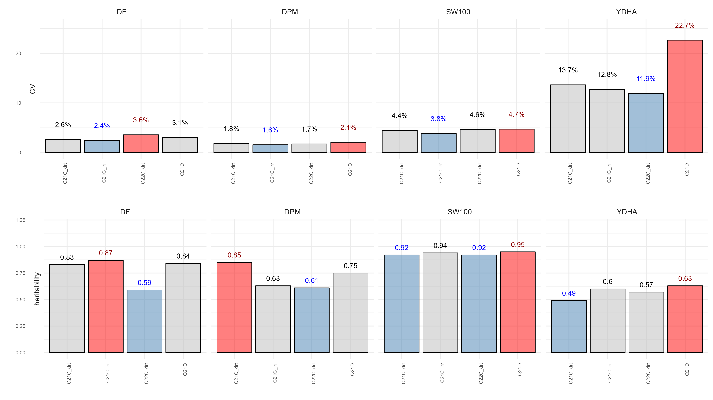

# Summary

`agriutilities` is an R package designed to make the analysis of field trials easier and more accessible for everyone working in plant breeding. It provides different functions that are useful in the analysis of field trials in agricultural experiments. It has a simple and intuitive interface to carry out Single Trial Analysis (STA) and Multi-Environmental Trial Analysis (MET), as well as, to estimate genetic parameters such as heritability, BLUPs, and variance components, among others. With this package you can perform analysis for Completely Randomized Design [@kuehl2001], Randomized Complete Block Design [@kuehl2001], Partially Replicated Designs [@Cullis2006], Alpha-Lattice Design [@kuehl2001], and Row-Column Designs.

Row-Column designs are more desirable for accounting for field spatial variations. Spatial Analysis is the most recommended when the row and column information is provided. “Many factors combine to generate micro-environments that differ from plot to plot, strongly influencing yield and other traits. It is necessary to correct them when estimating treatment and/or genotypic effects” [@rodriguez2018]. 

Whether you are a beginner or an experienced user, `agriutilities` will help you to carry out complex analyses quickly and easily with confidence. With built-in functions for fitting Linear Mixed Models (LMM), it is the ideal choice for anyone who wants to save time and focus on interpreting their results. `agriutilities` also provides a set of functions to create very sophisticated plots in an easy way and almost automatically.

# Statement of need

In agriculture, breeding has been used to continuously improve genotypes that are used to produce the crops that feed humanity. An essential part of the breeding programs is the field trials, where experiments are performed to evaluate different characteristics and properties of crops. In the breeding of crops, it is necessary to identify which ones have the desired characteristics, for example, nutritional characteristics or tolerance to drought, so it is very important to develop crop varieties that are healthy, resistant, and have a higher yield. When we carry out field trials, they must have appropriate management so that the experimental error is minimal between plots, and thus the best genotypes are easily detected.

Therefore, several questions can appear around how to model the different experimental designs, how to fit a spatial model, and how to analyze multiple trials. In breeding programs, there are complex scenarios that the data analyst faces when it comes to analyze the data collected. Some of those scenarios occur when there are multiple trials in different locations and in different years. The measured traits are not found in all the trials; not all genotypes are found in the locations; there are different experimental designs between trials; and there is missing data, among others. For this reason, the package `agriutilities` was designed to facilitate the analysis of field trials.

# Usage

When we have the data, the first thing that we must do is to identify the experimental design with the function check_design_met(), so we can check the quality of the data and identify the design. This works as a quality check before we fit any model. This function, in addition, allows the application of filters to the data, creates a summary of the traits and the experiments, creates a list with the experimental design detected, and prepares the data to be analyzed. For example, the summary of the traits by trial can provide us with information about the mean, median, variation, minimum and maximum of each trait by trial. Below is the code used to perform the data analysis pipeline.

``` r
# Data Analysis Pipeline

# (1) Installation 
install.packages("agriutilities")

# (2) Load library
library(agriutilities)

# (3) Read Data
datos <- readRDS("data/data_beans_VEF.RDS")
head(datos)

# (4) Check data
results <- check_design_met(
  data = datos,
  genotype = "Linea",
  trial = "trial",
  traits = c("YDHA", "DF", "DPM"),
  rep = "REP",
  block = "BLOCK",
  col = "col",
  row = "row"
)
results

# (5) Single Trial Analysis
out <- single_trial_analysis(results)
out

# (6) Multi-Environmental Trial Anaysis
met_results <- met_analysis(out)
met_results
```

Next, there is a function single_trial_analysis() where the previous results are used to adjust single-trial models. The mixed modeling engine used in this function is either `lme4` or `ASRreml`. The software `ASReml` provides a great deal of flexibility and utility for the analysis of field trials in breeding programs. For spatial designs, `SpATS` is always used, and for other designs, `ASReml` is used as a default. `agriutilities` relies on the `statgenSTA` package for most of the single trial analysis.  

This function can fit Completely Randomized Designs (CRD), Randomized Complete Block Designs (RCBD), Resolvable Incomplete Block Designs (res-IBD), Non-Resolvable Row-Column Designs (Row-Col), and Resolvable Row-Column Designs (res-Row-Col). Also, it removes extreme observations and generates BLUEs/BLUPs, heritability, and summaries by trial/trait. 

The single_trial_analysis() function is used to obtain a summary of the fitted models that shows the variation and heritability of each trait and the experimental design detected. Heritability describes how much variation in each trait can be attributed to the genetic variation. You can also graph the coefficient of variation and heritability for each trait, as shown in Figure 1.


<div align="center"> Fig 1. Summary of the fitted models. Coefficient of variation and heritability.</div>

Most field tests for plant breeding are replicated across different environments to measure the performance of breeding stocks across a range of environmental conditions to which a cultivar might be exposed. (Isik et al., 2017).

The results of the single_trial_analysis() function are used in met_analysis() to fit multi-environmental trial models. This function filters trials by heritability, fits GxE models by trait, estimates genetic correlations and overall heritability, calculates stability indices, and provides overall breeding values across locations. It helps to fit different variance-covariance structures. It integrates simpler variance covariances such as corv to more complex ones such as corgh or factor analytics.

In this package there is a S3 method that automatically generates a plot of the resulting objects check_desing_met, single_trial_analysis and met_analysis. This can generate a plot of missing data, connectivity, boxplot, and a summary of the variation and heritability. Also, there are plots of correlation, covariance, multi-traits, and a spatial plot. 

# Availability 

This package can be downloaded directly from the R platform. It is also available in the [GitHub](https://github.com/AparicioJohan/agriutilities) repository. Some of the functions require the R package `asreml` for the `ASReml` software which can be obtained upon purchase from [VSN international](https://vsni.co.uk/software/asreml-r).

# References
